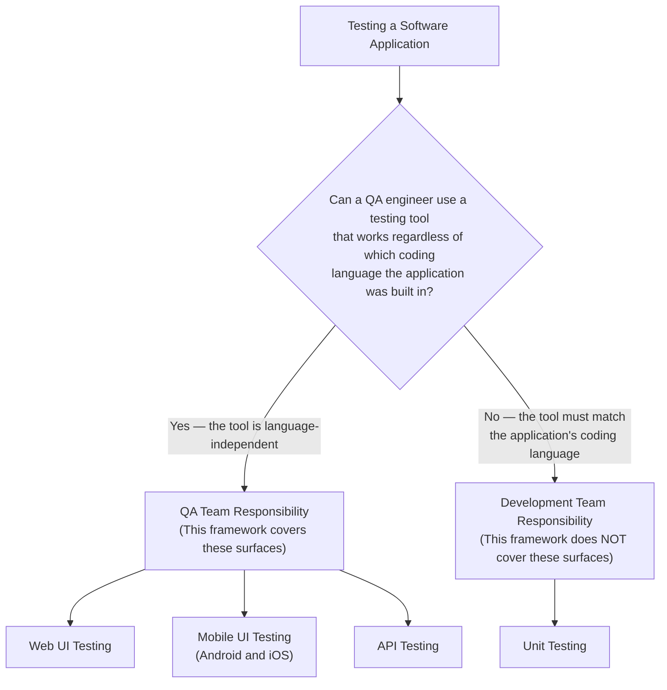
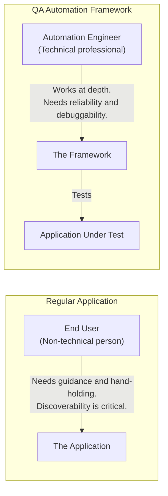
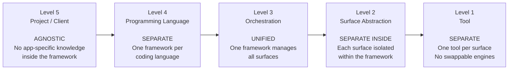
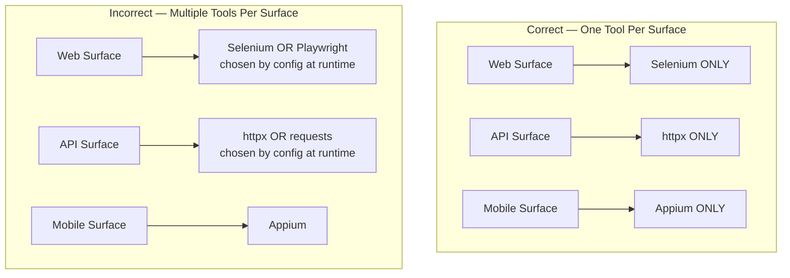
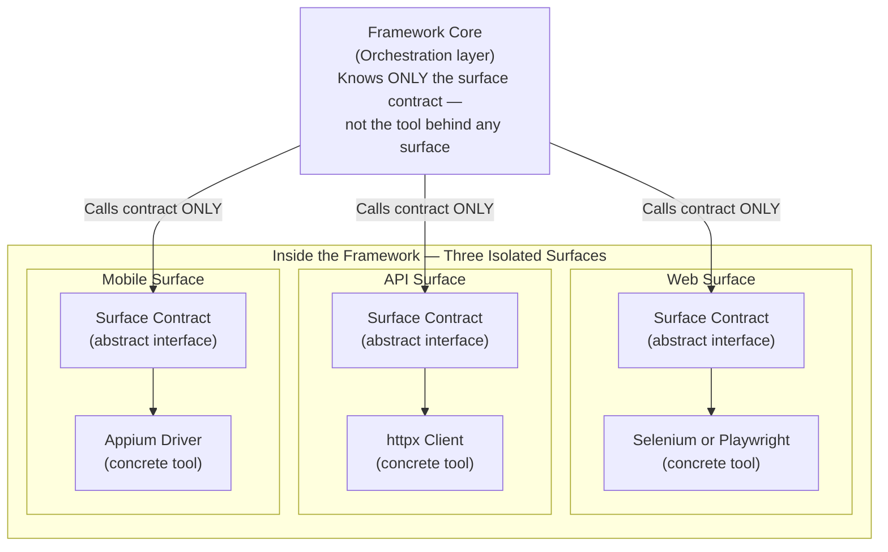
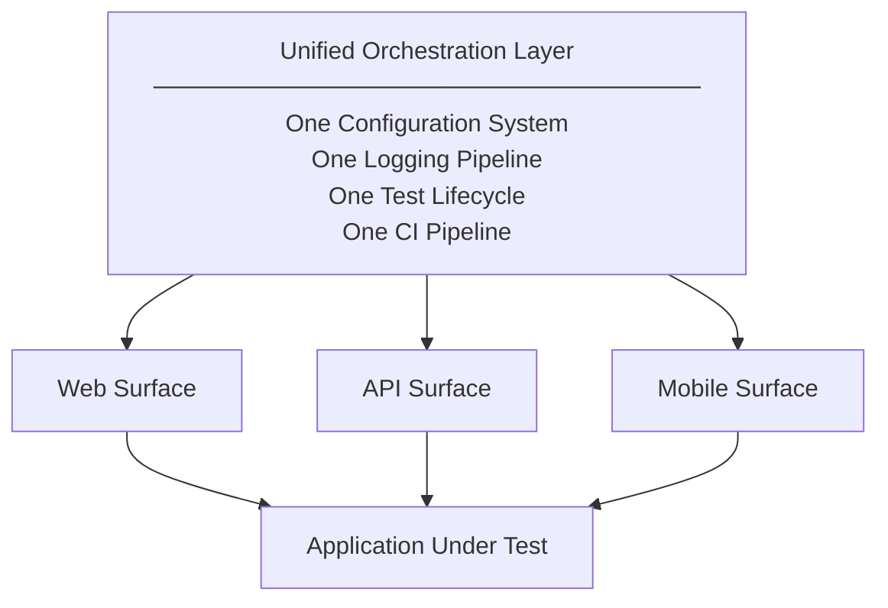
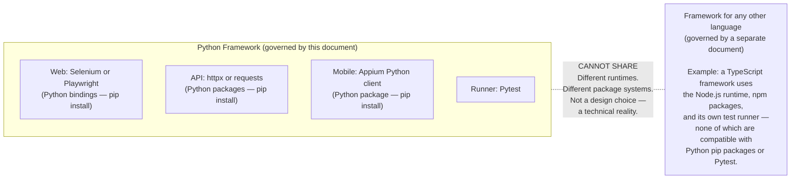
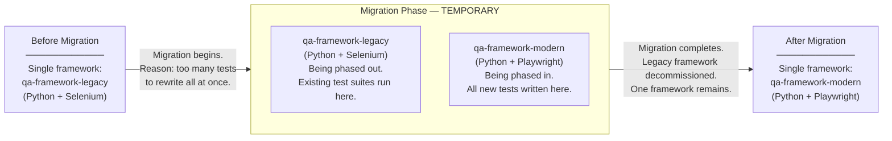

# Python QA Framework Architecture Rules and Recommendations
## Research-Validated Guidelines for Building Python QA Automation Frameworks

**Status:** Under Review — research-validated rules and evidence-backed recommendations  
**Language scope:** Python only. Other programming language ecosystems appear in this document only as illustrations showing that the same principles apply across languages. Each programming language has its own separate rules document.  
**Purpose:** This document defines the architectural rules and design recommendations for building a Python QA automation framework that can serve different types of companies, engineers, projects, and clients. A **rule** (marked ⚠️ RULE) is a non-negotiable structural decision — deviating from a rule produces documented failures. A **recommendation** (marked 💡 RECOMMENDATION) is the best-known design approach based on production evidence — a recommendation guides implementation but allows justified variation during the framework build phase.  
**Do not deviate from these rules for convenience, familiarity, or pattern mimicry from frameworks like Robot Framework.**

---

## Framework Scope

This document governs QA automation frameworks that cover three primary testing surfaces: Web UI testing (browser-based testing of web applications), Mobile UI testing (native or hybrid app testing on Android and iOS), and API testing (HTTP-level testing of application programming interfaces, independent of any UI layer).

The diagram below shows how to classify which testing surfaces belong to a QA automation framework and which testing surfaces belong to the development team.



### Why These Three Surfaces

A QA automation framework targets testing surfaces that a QA engineering team can test regardless of the coding language the application under test was written in. A QA engineer can test a Python-built web application using a browser automation tool written in a completely different language. A QA engineer can test a Java-built Android application using Appium through a Python or TypeScript test framework. The testing surface is what the test interacts with — not the application's internal source code.

The defining boundary of QA automation framework responsibility is this: a testing surface whose tooling is independent of the application's implementation language belongs to the QA team. The three surfaces this framework covers — Web UI, Mobile UI, and API — all satisfy this condition.

### Why Unit Testing Is Excluded

Unit testing is structurally different from the three surfaces covered by this framework.

A unit test must execute in the same coding language and runtime as the code the unit test is testing. A Python function can only be unit-tested by Python code. A Java class can only be unit-tested by Java code. A unit test directly imports and calls the application's internal functions — a unit test does not interact with a surface boundary that a QA tool can reach from the outside.

Because unit testing tooling is inseparable from the application's coding language, unit testing is inseparable from the development team that owns that language. Unit testing is the developer's responsibility, not the QA team's responsibility. A QA automation framework that targets unit testing is solving a problem the development team is already required to solve independently.

### Future Surfaces

Other forms of testing — performance testing, load testing, security scanning, and accessibility testing — are outside the scope of this framework at this stage. The rules in this document do not address these surfaces. These surfaces may be added to this framework in the future. When additional surfaces are added, the architectural rules in this document will govern the additional surfaces the same way the rules govern the current three surfaces.

---

## Who Consumes a QA Framework

A QA automation framework is not a consumer product. The primary consumers of a QA automation framework are engineers — automation engineers, QA engineers, and developers who write tests. This distinction determines what a QA automation framework must prioritize in its design.

The diagram below contrasts the consumer of a regular application with the consumer of a QA automation framework.



**A regular application is built for end users.** A regular application must be discoverable, self-explanatory, and forgiving of partial knowledge. An end user who does not know how to proceed should be guided by the application's own interface. A regular application can tolerate inconsistency as long as the application remains usable.

**A QA automation framework is built for engineers.** Engineers read documentation, understand tool internals, and operate at depth. A QA automation framework must optimize for the following properties:

- **Stability** — A QA framework's API must not change in ways that silently break existing test suites. Engineering teams build test suites on top of the QA framework. An unstable QA framework foundation propagates instability to every test suite built on top of that foundation.
- **Debuggability** — When a test fails, the engineer must be able to determine whether the failure is in the application under test, in the test itself, or in the framework. A QA framework that obscures the framework's own behavior makes failure triage slower and less reliable.
- **Learnability under depth** — An engineer must be able to go from surface-level framework usage to framework internals without encountering undocumented behavior, hidden state, or abstractions that collapse under examination.
- **Composability** — An engineer must be able to combine the framework's components in new ways as test requirements grow. A QA framework that cannot be extended through composition forces engineers to write workarounds instead of extending the framework properly.
- **Standardizability** — Multiple engineers and multiple teams must be able to use the same QA framework and produce test suites that are consistent enough to be maintained collectively.

A design shortcut that makes a QA framework easier to build but harder to debug, extend, or standardize is not a shortcut — the shortcut is a deferred cost that every engineer who uses the QA framework will eventually pay.

### Why Architectural Errors in QA Frameworks Cost More Than Architectural Errors in Regular Application Code

In a standard application development cycle, a bad architectural decision affects the application's own codebase. The engineering team that owns the application also owns the fix. The cost of the bad architectural decision is bounded to that one team.

A QA automation framework is a dependency of other teams' work — not a standalone product. Every engineering team that uses the QA framework to validate their application is trusting the QA framework to produce reliable results. This creates a different cost structure for architectural errors made inside the QA framework.

**A flawed QA framework does not fail loudly.** A flawed QA framework does not crash the engineering teams that depend on the QA framework. Instead, a flawed QA framework produces test results that look correct but are not. A misconfigured wait strategy inside the QA framework causes flaky tests. An incorrect error classification inside the QA framework hides real failures. A leaky abstraction inside the QA framework produces different behavior across different environments. Engineering teams relying on the QA framework may interpret these signals as problems with their own application — not problems with the QA framework — and spend significant engineering time debugging the wrong layer.

**The blast radius of a QA framework defect scales with how many teams use the framework.** A defect in one team's application code affects one team. A defect in a shared QA framework affects every engineering team that has adopted the QA framework. If a TCoE framework is used by ten engineering teams, a single foundational design mistake in the QA framework produces ten teams' worth of degraded test confidence, incorrect triage, and lost engineering time.

**Correcting a QA framework design mistake is expensive because adoption creates inertia.** Once a QA framework is in use by multiple engineering teams, changing the QA framework's design means coordinating changes across all those teams, running parallel migration periods, and managing transition windows where old and new QA framework behavior coexist simultaneously. A design mistake corrected before adoption requires one engineer to fix. The same design mistake discovered after widespread adoption requires a coordinated engineering effort across the entire organization.

The rules in this document must be applied at QA framework design time — not retrofitted after engineering teams have adopted the QA framework. A convenience shortcut taken during QA framework construction does not save engineering time. The shortcut distributes the cost of the shortcut across every team that depends on the QA framework.

---

## The Five Levels of Separation

A QA automation framework operates at five distinct levels, each with its own rule. Confusing levels or collapsing them produces architectural failures that compound over time.

The diagram below shows an overview of all five levels before each level is explained in detail. Read from left to right: Level 5 is the outermost organizational boundary; Level 1 is the most specific technical decision inside the framework.



---

## Level 1 — Tool Level: SEPARATE

**Rule: Each surface in a QA framework must be bound to one primary tool at design time. That tool must not be swappable at runtime and must not be hidden behind a multi-tool abstraction.**

**Tool** means the primary automation library or driver used by a surface.

This rule applies only to tool choice within a surface. It does not prevent the framework from supporting multiple surfaces, each with its own dedicated tool.

Each surface within a framework must use exactly one primary tool. That tool is chosen when the framework is designed, not by consumers at runtime. It is not exposed as a runtime option. It is not abstracted behind a multi-tool interface that allows the surface to switch implementations. The framework is tool-opinionated.

### What This Looks Like in Practice

```text
CORRECT — Python examples (governed by this document):

abc-framework (Python)
  Runner:         Pytest
  Web surface:    Selenium
  API surface:    httpx
  Mobile surface: Appium

xyz-framework (Python)
  Runner:         Pytest
  Web surface:    Playwright
  API surface:    requests
  Mobile surface: Appium

CORRECT — Cross-language illustration (TypeScript rules are documented separately):

uvw-framework (TypeScript)
  Runner (Web):    Playwright Test Runner (@playwright/test)
  Runner (Mobile): WebdriverIO runner
  Web surface:     Playwright (browser automation)
  API surface:     Playwright (request context)
  Mobile surface:  WebdriverIO + Appium

INCORRECT:

abc-framework
  Web surface: Selenium or Playwright chosen by config/runtime flag
  API surface: httpx or requests chosen by config/runtime flag
  Mobile surface: Appium
```

The incorrect example fails because it removes singular tool identity from the surface, expands the maintenance surface, forces consumers to understand more than one tool for the same surface, and weakens standardization.

The diagram below shows the same distinction visually.



### The Seven Validated Reasons Pattern A (Tool-Opinionated) Is Correct

These reasons are stated in order of depth and are intended to justify the rule in production and TCoE settings.

**Reason 1 — A TCoE That Standardizes Tools Should Not Encode Tool Fragmentation Into the Framework.**
A TCoE exists to reduce duplication and standardize testing practice across projects. A framework that supports multiple tools per surface turns fragmentation into an approved feature. That creates infrastructure for the very variability the TCoE is supposed to eliminate.

**Reason 2 — Tool-Agnostic Interfaces Hide Real Differences in Behavior.**
Non-trivial abstractions are leaky. Playwright and Selenium do not share the same communication model, failure modes, timing behavior, or debugging characteristics. A common interface built on top of both is materially misleading because it hides those differences and increases cognitive load during diagnosis.

**Reason 3 — Multi-Tool Abstractions Tend To Converge To The Lowest Common Denominator.**
When a framework tries to present two different tools as one surface, the abstraction usually exposes only the overlap between them. The result is a weaker framework that inherits neither tool's full strengths. Unique capabilities are either omitted or wrapped so loosely that they are no longer first-class.

**Reason 4 — Debugging Becomes A Multi-Layer Investigation.**
In a tool-opinionated framework, a failure is usually investigated at two points: the test code and the tool itself. In a multi-tool abstraction, the engineer must also inspect the abstraction layer and the specific implementation behind it. More layers mean slower triage, weaker signal, and more ownership ambiguity.

**Reason 5 — Tool Abstraction Can Produce Knowledge Atrophy In The Engineering Team.**
When engineers interact only with an abstraction, they learn the abstraction's API rather than the underlying tool's API. When the abstraction fails, the team may not have enough tool-level expertise to diagnose the issue quickly. A tool-opinionated framework encourages direct, compounding expertise in one tool.

**Reason 6 — In Regulated Environments, Specificity Reduces Compliance Ambiguity.**
In finance, healthcare, pharmaceutical, aerospace, and similar environments, testing tools may be part of audit scope. A framework that supports multiple tools per surface expands documentation, validation, and vulnerability management obligations. Keeping the tool fixed reduces ambiguity and lowers the compliance surface area.

**Reason 7 — During Migration, Separation Makes Progress Measurable.**
When an organization is moving from one tool to another, separating tools makes migration progress visible. Teams can measure which suites have moved, which remain, and whether the trend is improving. A multi-tool abstraction hides that state and makes migration harder to observe.

### Why Robot Framework Is Not A Counterexample To Follow

Robot Framework demonstrates that multi-tool orchestration is technically possible. That does not prove the architecture is preferable for a production QA framework or a TCoE. Its adoption proves viability, not optimality. Do not use Robot Framework's architecture as a template or justification for a tool-agnostic surface.

### Why This Rule Exists

The purpose of this rule is to make the framework easier to own in production:

- one surface maps to one tool,
- failures are easier to diagnose,
- onboarding is simpler,
- tool expertise compounds instead of fragments,
- and the framework remains opinionated enough to be standardizable across teams.

---

## Level 2 — Surface Abstraction Level: SEPARATE INSIDE THE FRAMEWORK

**Rule: Each surface has its own abstraction layer inside the framework. Surfaces do not share implementation details. Each surface encapsulates its own tool completely.**

A unified multi-surface framework does not collapse all surfaces into one. Each surface — web, API, mobile — is a distinct, isolated abstraction inside the framework. The surface abstraction handles all tool-specific concerns: session lifecycle, error classification, artifact capture, wait strategies, and tool-specific configuration. The rest of the framework (orchestration, configuration, logging, CI integration) knows nothing about any specific tool — only about the surface abstraction contract that every surface must satisfy.

This is the correct architecture because it allows the framework to be multi-surface without being multi-tool. The surfaces are what varies. The framework core is what unifies.

### Why Multi-Surface Under One Framework Is Correct

This is the Level 3 rule (Orchestration Level) but it requires validation here because it is the counterintuitive finding.

**Validated finding: A single QA framework must support multiple surfaces. Separate frameworks per surface is an antipattern in TCoE settings.**

- 40% of production incidents stem from integration issues between UI and API layers that siloed testing approaches consistently miss (Virtuoso QA, validated survey data from US, UK, India).
- Unified frameworks reduce maintenance effort by 60% through eliminated duplication and accelerate test creation by 5x when teams do not switch between tools.
- 74.6% of teams running two or more frameworks simultaneously is documented by the World Quality Report as a pain point — "coordination overhead, tooling sprawl, and skills fragmentation" — not as a design goal.
- The documented real-world engineering journey (Cerberus Testing) shows that teams starting with single-surface frameworks always hit the point where they need a second surface and must choose: extend or fragment. Every experienced engineer who reasons through this chooses extension.
- A TCoE framework that ships a web-only framework, an API-only framework, and a mobile-only framework has created three things for teams to adopt instead of one, three codebases to maintain, three onboarding documents, and zero ability to write tests that span surfaces.

Every major production multi-surface framework validates this: Robot Framework (SeleniumLibrary + AppiumLibrary + RESTinstance), Carina (web + mobile + API + DB), Toolium (Selenium + Appium in one project), Webomates (web + API + mobile in one framework). These arrived at the same conclusion independently.

The diagram below shows how each surface is isolated inside the framework while the framework core remains completely unaware of any specific tool.



---

## Level 3 — Orchestration Level: UNIFIED

**Rule: One framework orchestrates all surfaces. Shared configuration, shared logging, shared lifecycle management, shared CI integration.**

The framework is the single system of record for all testing activity. Every engineering function has a system of record. Developers have GitHub. Product teams have Jira. Infrastructure has Datadog. A QA team without a unified framework has no equivalent — their answer to "where is your single source of truth?" is "it depends which tool you mean." The TCoE framework is supposed to be the QA team's system of record.

A unified orchestration layer provides:

- One configuration system all surfaces read from. Environment switching, credential management, timeout configuration, and environment-specific overrides work identically regardless of which surface a test uses.
- One logging pipeline all surfaces write to. Every log event from every surface carries the same session ID, test ID, environment, and surface name. Log aggregation, dashboards, and alerting work against a single, consistent schema.
- One test lifecycle that routes setup and teardown calls to the correct surfaces per test based on markers. A test marked as web-only activates only the web surface's per-test hooks. A test marked as both web and API activates both.
- One CI pipeline that runs all surfaces in one execution, produces one unified report, and fails or passes as one unit.

The diagram below shows how the unified orchestration layer connects to all surfaces and ultimately to the application under test.



---

## Level 4 — Programming Language Level: SEPARATE

**Rule: Every programming language has its own framework. A Python framework does not serve projects written in other languages. A framework built for one language's runtime cannot run in another language's runtime. There is no cross-language framework.** ⚠️ RULE

Each programming language has its own runtime, its own tool ecosystem, its own package management system, and its own testing toolchain. A Python QA framework depends on Python packages — for example, Selenium's or Playwright's Python bindings, httpx or requests for HTTP, and the Appium Python client for mobile — and runs under Pytest. A framework built for a different programming language runs in a different runtime, uses a different package manager, and cannot share libraries with the Python framework. A Python QA framework and a framework for any other language are not interchangeable. This document governs the Python QA framework only. Framework rules for other programming languages are documented in separate documents.

### Python Stack Reference

```text
Python (Legacy):
  Runner:    Pytest
  Web UI:    Selenium
  API:       requests or httpx
  Mobile UI: Appium

Python (Partially Modern):
  Runner:    Pytest (pytest-playwright plugin for web surface)
  Web UI:    Playwright
  API:       httpx
  Mobile UI: Appium
```

> **Note — API surface scope and the shared HTTP utility 💡 RECOMMENDATION**
>
> The **API surface** covers pure API testing — sending HTTP requests directly to application endpoints and asserting on the responses, with no browser and no mobile device involved. The API surface does not cover HTTP calls that web tests or mobile tests make during their own setup or teardown.
>
> Web tests and mobile tests regularly need to make HTTP calls as part of their own work: creating test data via API before a browser interaction starts, resetting application state before a test run, or checking backend state after a UI action. These HTTP calls are handled through a **shared HTTP utility** — a configured HTTP client that lives in the framework core (for example, `core/http_client.py`), one level below the surface abstractions.
>
> The shared HTTP utility is an `httpx.Client` or `requests.Session` configured with the base URL, authentication credentials, TLS settings (TLS, or Transport Layer Security, ensures the connection is encrypted), and logging. The shared HTTP utility is exposed as a pytest session fixture — a shared setup object that stays active for the entire test run — so any test can use the shared HTTP utility without repeating the connection setup.
>
> **How each test type uses the layers:**
> - API test: `test body → API surface abstraction → shared HTTP utility`
> - Web test: `test setup/teardown → shared HTTP utility directly` + `test body → web surface`
> - Mobile test: `test setup/teardown → shared HTTP utility directly` + `test body → mobile surface`
>
> The shared HTTP utility is not a surface. The shared HTTP utility enforces the same connection security, credential handling, and logging as the API surface. Every HTTP call made through the shared HTTP utility — whether the call comes from an API test or from a web test's setup hook — is written to the framework's unified logging pipeline with the same run ID, test ID, and surface identifier. In regulated environments such as healthcare and banking, every HTTP call in the test run must be traceable regardless of which surface made the call. The shared HTTP utility satisfies this requirement because all HTTP access in the framework routes through the shared HTTP utility.
>
> **Three questions left open for the framework design phase:** (1) Whether the shared HTTP utility should support asynchronous HTTP calls — calls that do not block the test from continuing while waiting for a response — which matters when Playwright is the web tool because Playwright runs asynchronously. (2) How the shared HTTP utility reads its configuration (base URL, credentials, TLS) from the framework's central configuration system. (3) Whether the shared HTTP utility should support separate logged-in identities used simultaneously within a single test, which is required when banking security tests need to verify that a request from one user cannot access another user's data.

The diagram below shows why a Python QA framework cannot share libraries or runtime components with a QA framework built for any other programming language.



### The TCoE ONE-Framework-Per-Language Mandate

Language separation — one framework per language — is a technical constraint driven by runtime incompatibility. But within a given language, there is also an organizational design mandate: a TCoE must operate with exactly one framework per language.

This means:
- One Python QA framework in the TCoE — not two competing Python frameworks.
- One QA framework per language for every language the TCoE supports — the same mandate that applies to Python applies to any other language whose framework the TCoE governs.

The reason is identical to the reason TCoEs exist: to eliminate duplication, standardize practice, and reduce the coordination overhead that comes from fragmentation. Two Python frameworks inside one TCoE create two onboarding paths, two maintenance burdens, two tooling stacks, and zero shared institutional knowledge between them. Two Python frameworks fragment the team the same way separate surface-specific frameworks fragment the team.

The TCoE ONE-framework-per-language rule is a **design mandate** — a description of the intended target state. The ONE-framework-per-language rule is not a description of all observable reality at all times, because real-world constraints sometimes force a temporary exception. That exception is not a design choice. The exception is documented in the section below.

### When Multiple Frameworks Per Language Exist: The Migration Case

The one-framework-per-language mandate describes what the TCoE is working toward — the stable, intended end state. The mandate does not describe every situation a real organization will encounter during its lifetime. There is one legitimate scenario in which two frameworks in the same language coexist: **an active migration from one primary tool to another**.

When a TCoE or an engineering team must move from one primary tool to another — for example, from a Selenium-based Python framework to a Playwright-based Python framework — both frameworks will coexist during the transition period:

```text
qa-framework-legacy/    ← Python + Selenium  (existing system being phased out)
qa-framework-modern/    ← Python + Playwright (new standard being phased in)
```

This coexistence happens because:

- **Existing test suites are large.** Thousands of tests may exist against the legacy framework. Rewriting every test before migration is complete is not economically feasible.
- **Engineering teams must continue delivering.** Engineering teams cannot pause delivery to wait for a framework migration to finish. The legacy framework must remain operational while migration is in progress.
- **Rewriting is incremental by necessity.** Teams migrate surface by surface and suite by suite. This process takes months in large organizations.

The diagram below shows the migration as a time-bounded transition, not a permanent state.



**The critical distinction: the migration scenario is a forced, bounded reality — not a design choice.**

The existence of two frameworks during a migration does not mean two frameworks are architecturally correct. The existence of two frameworks during a migration means the transition to one framework is actively in progress. The legacy framework is a liability being wound down — not an approved permanent alternative to the modern framework.

The expected outcome of a migration scenario is always convergence: the legacy framework is deprecated and decommissioned, and one framework remains. If an organization reaches a state of stable, indefinite dual-framework operation within the same language without an active migration underway, that state is a TCoE failure — not a valid architectural configuration.

---

## Level 5 — Project/Client Level: AGNOSTIC

**Rule: The framework knows nothing about any specific application, client, or project. It knows only about surfaces and the contracts those surfaces must satisfy.**

A framework that contains application-specific knowledge — hardcoded selectors, application-specific data models, authentication flows tied to a specific login page, environment names that reference a client's infrastructure — is not a framework. It is a bespoke automation codebase with the word "framework" in the repository name.

Project/client agnosticism means:

- No application selectors or locators anywhere in the framework core or surface implementations.
- No data models that represent entities from any specific application (no `OrangeHRMEmployee`, no `ClientXOrder`).
- No authentication strategies implemented for a specific authentication provider.
- No environment names or URLs that reference any client's infrastructure.
- No assertions that assume application-specific behaviour.

The reference implementation (the concrete tests written against a specific application to demonstrate the framework) lives in a completely separate directory or repository. The reference implementation imports from the framework the same way any consuming team would. The reference implementation is a consumer of the framework, not part of the framework.

Client-agnosticism is a direct consequence of project-agnosticism. A framework that works for any project works for any client. A framework that contains client-specific knowledge fails every other client.

---

## The Complete Rules Reference

| Level | Rule | Keyword |
|---|---|---|
| Tool | One tool per surface. No swappable engines. No multi-tool abstraction. | SEPARATE |
| Surface Abstraction | Each surface has its own isolated abstraction inside the framework. | SEPARATE INSIDE |
| Orchestration | One framework manages all surfaces. Shared config, logging, lifecycle, CI. | UNIFIED |
| Programming Language | Each language has its own framework. No cross-language frameworks. | SEPARATE |
| Project / Client | The framework knows nothing about any application or client. | AGNOSTIC |

---

## What a Correctly Designed Framework Looks Like

```text
my-framework/                        ← One framework per language
├── core/                            ← Orchestration layer — knows nothing about tools
│   ├── surface_contract.py          ← The abstract interface every surface must satisfy
│   ├── session_manager.py           ← Lifecycle orchestration across surfaces
│   ├── config/                      ← Unified configuration system
│   └── logging/                     ← Unified logging pipeline
│
├── surfaces/
│   ├── web/                         ← Web surface — Selenium ONLY (or Playwright ONLY)
│   │   └── surface.py               ← Wraps Selenium completely. No Playwright here.
│   ├── api/                         ← API surface — httpx ONLY
│   │   └── surface.py               ← Wraps httpx completely. No requests here.
│   └── mobile/                      ← Mobile surface — Appium ONLY
│       └── surface.py               ← Wraps Appium completely.
│
└── examples/                        ← Reference implementation ONLY
    ├── web_tests/                   ← Tests against a real application
    ├── api_tests/                   ← Project-specific tests that CONSUME the framework
    └── mobile_tests/                ← These are NOT part of the framework
```

---

## What Violates These Rules

The following are violations of these rules, ordered from most severe to least severe.

**Critical violations — destroy the framework's architectural integrity:**
- Supporting two web automation tools (e.g., Selenium AND Playwright) in the same web surface, regardless of whether they are swappable or used simultaneously.
- Placing application-specific selectors, data models, or auth flows inside the framework's core or surface implementations.
- Building separate frameworks per surface (a web framework, an API framework, a mobile framework) instead of one unified multi-surface framework.

**Significant violations — undermine TCoE adoption and maintainability:**
- Using two different languages in the same framework (e.g., Python core with a TypeScript surface).
- Sharing implementation code between surfaces (web surface code calling API surface code directly).
- Placing reference implementation tests in the same package as the framework code.

**Minor violations — accumulate technical debt:**
- Allowing configuration that is not environment-agnostic (hardcoded environment names or URLs).
- Allowing log events that do not carry the shared session identifier.
- Allowing a surface to be instantiated before the framework's configuration system has validated and loaded its settings.

---

## Derivation and Evidence Summary

| Rule | Primary Evidence Source |
|---|---|
| Tool separation — Pattern A | Seven-reason analysis: TCoE mandate, Law of Leaky Abstractions (Spolsky), Thoughtworks Technology Radar LCD antipattern, debugging depth, knowledge atrophy, compliance requirements, migration observability |
| Multi-surface unified framework | 40% production incidents from siloed testing (Virtuoso QA); 60% maintenance reduction (Virtuoso QA); 74.6% multi-framework pain point (World Quality Report 2025-26); Robot Framework, Carina, Toolium, Webomates production evidence; Cerberus Testing documented engineering journey |
| Language separation | Python/Node runtime incompatibility; language-specific package ecosystems; not a design choice but a technical reality |
| Project/client agnosticism | TCoE reuse mandate; framework-vs-application separation principle; reference implementation isolation pattern (industry standard) |

---

*This document is derived from validated industry research, production framework evidence, and senior/principal engineering practice as of 2025–2026. It is not based on textbook theory, framework marketing, or convenience-driven architectural shortcuts.*
